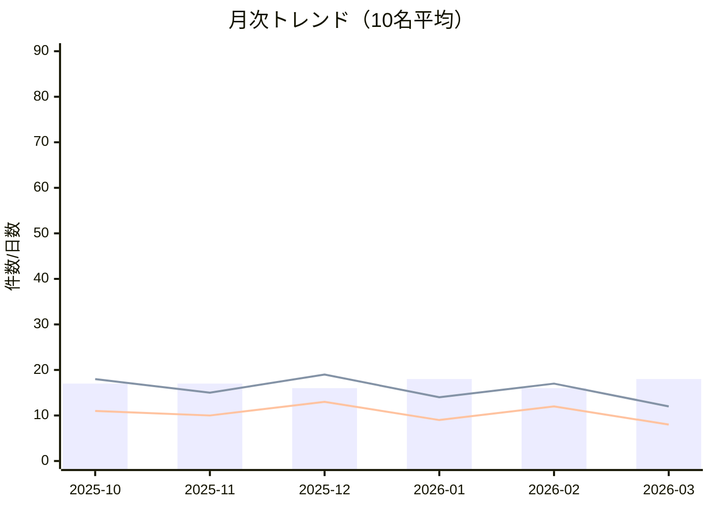

# 利用者10名 6か月KPIダッシュボード（デモ）
- 期間: 2025-10〜2026-03
- 対象: 利用者A〜J（匿名化済み）

月次KPI
| 月 | 平均出席日数 | 平均作業時間(時間) | 体調不良欠席(件) | 遅刻(件) | 相談記録(件) | イレギュラー(件) |
|---|---:|---:|---:|---:|---:|---:|
| 2025-10 | 16.8 | 79 | 14 | 18 | 42 | 11 |
| 2025-11 | 17.2 | 82 | 12 | 15 | 39 | 10 |
| 2025-12 | 16.1 | 74 | 16 | 19 | 45 | 13 |
| 2026-01 | 17.5 | 84 | 10 | 14 | 37 | 9 |
| 2026-02 | 16.4 | 76 | 15 | 17 | 41 | 12 |
| 2026-03 | 17.6 | 85 | 9 | 12 | 35 | 8 |

利用者別サマリー（6か月累計）
| 利用者 | 出席日数 | 目標達成率 | 主な課題 | 直近評価 |
|---|---:|---:|---|---|
| 利用者A | 102 | 76% | 睡眠乱れによる欠席 | B+ |
| 利用者B | 106 | 81% | 対人緊張 | A- |
| 利用者C | 98 | 73% | 報連相遅延 | B |
| 利用者D | 95 | 69% | 遅刻傾向 | B- |
| 利用者E | 109 | 84% | 段取り不足 | A- |
| 利用者F | 104 | 79% | 確認過多 | B+ |
| 利用者G | 97 | 71% | 衝動発言 | B |
| 利用者H | 93 | 68% | 不安発作 | B- |
| 利用者I | 101 | 75% | 提出遅れ | B |
| 利用者J | 107 | 82% | 疲労蓄積 | A- |

トレンド図（mermaid）

所見
1. 12月・2月に体調要因で欠席/遅刻が増加。
2. 3月は相談記録が減り、目標達成率が改善。
3. 記録の即日入力率向上がイレギュラー減少に寄与。

