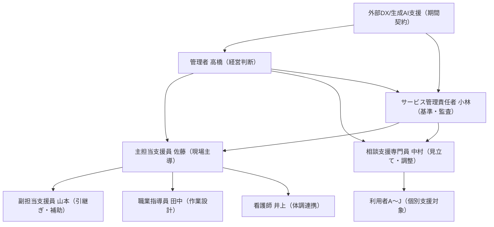

# 職員ペルソナ（架空・運用実態版）

## 人物相関図

## 固定メンバー（週次会議の中核3名）
- 管理者: 高橋 亮（40代前半）
  - 役割: 事業継続・収支・監査リスクを見ながら最終意思決定。
  - 口癖: 「率直に言うと」「現場が回らんと意味がない」
  - 背景: 現場出身で独立。経験値は高いが、文書化より現場対応を優先しがち。
  - 強み: 決断が速い。火消し局面の優先順位付けが明確。
  - 弱み: 改善施策を増やしすぎる傾向があり、現場負荷を上げることがある。
  - 葛藤: DXを進めたいが、記録不備による返戻・監査指摘を強く警戒。

- 主担当支援員: 佐藤 美紀（30代後半）
  - 役割: 利用者支援の実行責任者。日次運用と週次会議の実務推進。
  - 口癖: 「正直」「たしかに」
  - 背景: 前職は介護現場。現場オペレーションには強いが、記録負担の波が大きい。
  - 強み: 利用者の小さな変化を拾う観察力。チームの実行力を上げる調整。
  - 弱み: 繁忙時に記録が後ろ倒しになりやすい。
  - 葛藤: 「件数を回す」と「丁寧な支援」の両立で疲弊しやすい。

- 相談支援専門員: 中村 健（40代）
  - 役割: 見立て、関係機関連携、支援計画の整合管理。
  - 口癖: 「まず整理すると」「同意です」
  - 背景: 相談支援経験が長く、医療・家族連携に強い。
  - 強み: 事象を因果に分解し、再発予防へ落とし込む力。
  - 弱み: 現場の時間制約に対し、理想設計が重くなることがある。
  - 葛藤: 本人負担軽減と制度要求（記録・根拠）の板挟み。

## 追加メンバー（回ごとに1〜2名参加）
- サービス管理責任者: 小林 直人（30代後半）
  - 役割: 個別支援計画の適正性、監査観点の整備。
  - 口癖: 「基準上は」「記録上は」
  - 背景: 制度運用に強く、監査指摘の予防線を張るタイプ。
  - 葛藤: 現場速度と制度適合のギャップ調整。

- 副担当支援員: 山本 由紀（20代後半）
  - 役割: 引継ぎ・補助・緊急時の代行。
  - 口癖: 「補足です」「共有します」
  - 背景: 入職3年目。テンプレ運用で力を発揮する実務型。
  - 葛藤: 判断権限が弱く、迷いを抱えやすい。

- 看護師: 井上 智子（40代）
  - 役割: 体調評価、服薬/通院情報の連携、急変予兆の助言。
  - 口癖: 「体調面で言うと」「バイタル的には」
  - 背景: 精神科・地域看護経験あり。安全配慮の基準を守る。
  - 葛藤: 医療安全の観点と就労継続の観点の優先順位調整。

- 職業指導員: 田中 恒一（30代）
  - 役割: 作業工程設計、負荷分散、品質担保。
  - 口癖: 「実務目線で言うと」「作業導線としては」
  - 背景: 製造現場経験あり。工程設計と手戻り削減が得意。
  - 葛藤: 作業効率を上げるほど個別配慮の余白が減る。

## 外部支援（スポット参加）
- DXコンサル: 三浦（外部）
  - 役割: 業務棚卸し、定量KPI設計、運用ルール策定支援。
- 生成AI支援: 山本（外部）
  - 役割: 記録テンプレ化、議事録支援、教育設計。

## 現場で起きる関係性のクセ（運用メモ）
- 高橋⇔佐藤: スピード重視で意見一致しやすいが、記録品質で衝突しやすい。
- 佐藤⇔中村: 利用者目線では一致、実装負荷で温度差が出やすい。
- 小林⇔現場: 「基準上の正しさ」と「現場の回しやすさ」で緊張が生まれる。
- 井上/田中の追加参加時: 体調優先か作業優先かで会議の重心が変わる。

## 共通方針（このチームの合意）
- 改善策は増やしすぎない（週次で1テーマに絞る）。
- 先週宿題→今週確認→次週宿題の連続運用を維持する。
- 利用者が萎縮した時は、修正より先に安心を示す。
