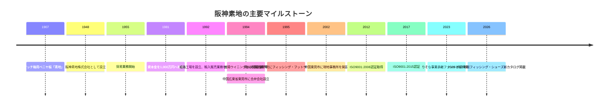
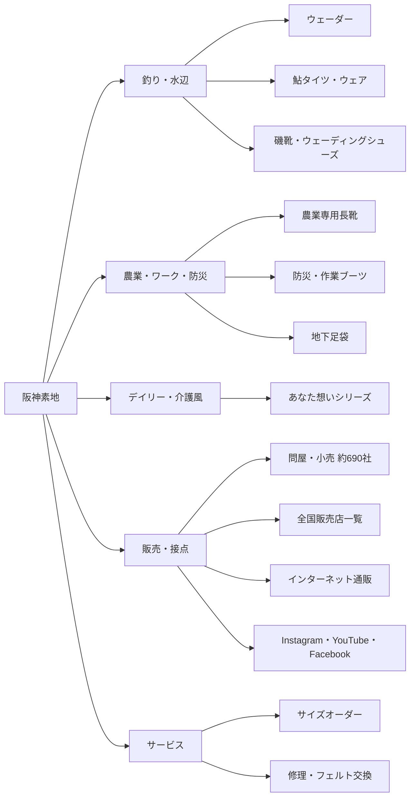

# 阪神素地株式会社 調査報告

日本時間 2026-05-13 02:39 JST 現在。 citeturn47time0

本調査はurl阪神素地公式サイトhttps://hanshinkiji.co.jp/とurl公式Instagramhttps://www.instagram.com/hanshinkiji_official/を一次情報の主軸に、公的DB、官公庁資料、金融機関の公式リリース、競合各社の公式サイトで補完した。公式資料で確認できない項目は未記載または未公開と明記した。構成はユーザー提示要件に準拠している。 fileciteturn0file0

## エグゼクティブサマリー

阪神素地株式会社は、創業1907年、設立1948年の老舗で、本社は兵庫県高砂市、営業部は岡山市東区、資本金は1,000万円、従業員数は21人、代表者は代表取締役の西脇義修氏である。会社案内では、国内の釣具・履物問屋、小売店など約690社への販売、ウェットスーツ・ウェーダー等の製造、中国・台湾からの輸入、中国広東省の合弁会社運営を明示している。 citeturn13search0turn16view0

事業ポートフォリオは、釣り・水辺向け製品を中核にしつつ、農業・ワーク・防災向け長靴、シニア・介護風の快適履物まで広い。商品一覧ページ上では、長靴36、ウェーダー26、スニーカー20、ウェア17、アウトドアシューズ16、地下足袋14など、少なくとも9カテゴリ・計152項目の掲載が確認でき、単一ニッチではなく複数用途に展開する多角型フットウェア企業と位置づけられる。 citeturn49view0

技術面では、国産生地を使う国産スリムウェーダー、東レの透湿防水生地を使う防災・釣り向けウェーダー、果樹専用のオリジナルソール、自社開発ラスト・底型、スーパークッションインソール、修理サービス、サイズオーダー対応が確認できる。一方で、工場設備の詳細、生産能力、研究開発費は未公表である。品質面ではISO9001:2015認証を掲げるが、gBizINFO上の知財件数は特許0、意匠0、商標8で、特許訴求型よりも商品企画・用途別設計・補修対応型の競争力が中心とみられる。 citeturn23search8turn12search4turn41search0turn41search2turn41search3turn10view0turn16view0

販売面では、ユーザー向け直接販売はしておらず、全国の釣具店・地域小売・インターネット通販を通じた間接販売が基本である。公式サイトは販売店一覧、FAQ、修理、サイズオーダーを整え、Instagram・YouTube・Facebookを接続している。採用情報では営業・企画、デザイナーを岡山営業部で募集しており、応募窓口はハローワークのみである。財務数値は未公開だが、gBizINFOには防衛省向け胴付き長靴の調達実績が掲載され、2023年にはりそな事業承継ファンドが投資を実行している。 citeturn50view0turn20view2turn53search0turn51search6turn46view0turn16view0turn45search1

今後の機会は、高齢化、農業就業者の高齢化・省力化需要、防災備え需要、釣り人口の底堅さにある。他方、輸入依存、中国・台湾サプライチェーン、小規模人員、直販不在、財務非開示、設備情報非開示は主要リスクである。したがって、営業・提携・投資の観点では「高付加価値ニッチを磨く」「B2Bチャネルを深掘る」「情報開示とデジタル接点を増やす」の3点が最も重要である。 citeturn31search0turn31search1turn33search5turn48search7turn13search0turn50view0turn16view0

## 会社概要と沿革

### 会社概要

| 項目 | 内容 | 出典 |
| --- | --- | --- |
| 設立年 | 1948年。法人設立年月日は1948年4月12日 | citeturn13search0turn16view0 |
| 創業年 | 1907年 | citeturn13search0 |
| 所在地 | 本社：entity["city","高砂市","hyogo japan"]荒井町南栄町10番地6号／営業部：entity["city","岡山市","okayama japan"]東区瀬戸町瀬戸136番地 | citeturn13search0 |
| 資本金 | 1,000万円 | citeturn13search0turn16view0 |
| 従業員数 | 21人 | citeturn13search0 |
| 代表者 | 代表取締役 entity["people","西脇 義修","hanshin kiji ceo"] | citeturn13search0turn16view0 |
| 主要事業 | アウトドア用作業衣料・履物の企画製造販売、一般履物・作業用履物・長靴の企画製造販売、OEM製造、貿易業務全般 | citeturn11view0turn13search0 |
| 販売先規模 | 国内の釣具・履物問屋、小売店等、約690社 | citeturn13search0 |
| 製造・輸入 | ウェットスーツ、ウェーダー、クロロプレンスポンジ製品の製造。輸入先は中国・台湾 | citeturn13search0 |
| 合弁会社 | WINNING INDUSTRIAL CO., LTD.（中国広東省） | citeturn13search0 |
| 公的情報補足 | gBizINFOで全省庁統一資格を保有。物品販売の営業品目に衣服・ゴム／皮革／プラスチック製品、防衛用装備品類などが掲載 | citeturn16view0 |

### 沿革と主要マイルストーン

この沿革から読み取れる転換点は3つある。第1に、原材料「素地」から履物・ウェア企業への業態転換。第2に、1992年以降の姫路工場設立、1994年の営業権取得、中国合弁会社設立による、釣り・水辺用途への本格シフト。第3に、2012年以降の品質認証と、2023年の事業承継ファンド投資を経た次世代移行局面である。近年は展示会出展とカタログ更新を通じて、商品訴求を継続している。 citeturn13search0turn45search1turn45search2turn17search6

## 事業内容と製品ラインナップ

公式サイトの事業内容は、概ね「釣り・アウトドア系作業衣料／履物」「一般履物・作業履物・長靴」「貿易業務」の3本柱で整理できる。実際の商品一覧では、釣り、水辺、防災、農業、介護風、デイリーまでシーン別に横展開されており、最多カテゴリは長靴36、次いでウェーダー26、スニーカー20である。つまり同社は、釣り専業ブランドではなく、「水辺・屋外・足元」に強い多用途メーカーとみるのが実態に近い。 citeturn11view0turn49view0

図の関係は、商品一覧、FAQ、会社案内、トップページの導線に基づく。販売はB2B流通中心だが、修理とサイズオーダーを通じてエンドユーザー接点も維持している。 citeturn49view0turn50view0turn20view2turn13search0turn10view0

### 代表的な製品ラインナップ

| 製品名 | 主用途 | 技術的特徴 | 主な対象顧客・業界 | 出典 |
| --- | --- | --- | --- | --- |
| FX-590 国産スリムウェーダー（中割） | 鮎釣り・渓流釣り | 国産生地、3.5mm厚CRスポンジ、調節式ウエストベルト、ハンガーループ、職人による日本製 | 鮎・渓流釣りユーザー、専門釣具店 | citeturn23search8turn50view0 |
| BC-101 チェストハイウェーダー | 一般釣行・水辺作業 | スリムアーチシルエット、50mm肩ベルト・ウエストベルト、内側メッシュ、大きめ胸ポケット | 一般釣りユーザー、釣具店 | citeturn12search14turn50view0 |
| BW-80 透湿防水防災ウェーダー | 防災・ワーク | 東レの透湿防水生地、脱着可能肩ベルト、再帰反射材で夜間視認性向上 | 防災備蓄、自治体・法人、作業用途 | citeturn12search4turn16view0 |
| BC-942 フェルトスパイクシューズ | 磯釣り・海釣り | シームレス構造、スーパークッションインソール、足首ガード、撥水アッパー、内側ファスナー | 磯・海釣りユーザー、釣具店 | citeturn22search1turn50view0 |
| FX-620 鮎タイツ | 夏場の鮎釣り・アユイング | 2mm厚CRスポンジ、ヒザ・スネ補強、上下開放式Wファスナー、足首内側ファスナー | 鮎釣りユーザー、釣具店 | citeturn22search0turn50view0 |
| FU5014 果樹専用長靴 かじゅなが | 果樹農業 | 片手で絞れるフード、クッションインソール、履きやすい丈、土詰まりしにくいオリジナルソール、摘果果実を踏んでも響きにくい厚底設計 | 果樹農家、とくに青森・愛媛など果樹用途 | citeturn21search1turn41search2turn54search1 |
| BN-860 多機能ブーツ | ワーク・防災 | 鋼鉄製先芯、踏み抜き防止板、耐油・耐薬品・防滑・静電防止・反射材・フード付 | ワークショップ、防災用途、官公需候補 | citeturn23search0turn16view0 |
| LE3950 / ME2950 羽マジックシューズ | デイリー・介護風 | 大きく開く甲部、履きやすさ・履かせやすさ、ラバー付きソール、スーパークッションインソール | シニア需要、介護風需要、地域小売 | citeturn24search3turn24search5 |

製品群を俯瞰すると、同社の中核強みは「水辺特化の機能性」と「現場用途ごとの履きやすさ設計」の両立にある。とくに、国産ウェーダー、透湿防水、防災機能、農業女子との共同開発、介護風の履かせやすさは、単純な廉価長靴メーカーとの差別化要素である。 citeturn23search8turn12search4turn21search1turn41search0turn24search3

## 生産体制と技術力

| 項目 | 確認内容 | 評価 | 出典 |
| --- | --- | --- | --- |
| 国内生産拠点 | 1992年に姫路工場を設立。ウェットスーツ、ウェーダー、その他クロロプレンスポンジ製品を製造 | 水辺・クロロプレン系の内製ノウハウを持つ | citeturn13search0 |
| 海外調達・生産 | 中国広東省の合弁会社WINNING INDUSTRIAL CO., LTD.、2002年開設の東莞現地事務所、中国・台湾からの輸入 | 海外調達ネットワークを持つ一方、地政学・物流・為替の影響を受けやすい | citeturn13search0 |
| 設計技術 | 東レ透湿防水生地、国産生地、CRスポンジ、自社開発ラスト・底型、スーパークッション、オリジナルソールなどを明示 | 汎用品販売ではなく、素材選定と足型設計で差別化している | citeturn12search4turn23search7turn23search8turn41search0turn41search2turn41search3turn41search8 |
| アフターサービス | 水漏れ、破れ、ファスナー、フェルト交換などの修理。標準納期は通常2週間程度。サイズオーダーはスリムウェーダー・ウェットスーツ対応 | 補修とカスタム対応があり、使用寿命延長と高付加価値化に寄与 | citeturn10view0turn50view0 |
| 品質認証 | 2012年ISO9001:2008認証取得、2017年ISO9001:2015認証 | 品質管理のベースは整備済み | citeturn13search0 |
| 知財 | gBizINFO掲載は特許0、意匠0、商標8 | 知財競争力は商標中心。特許による防御は限定的 | citeturn16view0 |
| 設備情報 | 工場設備名、ライン能力、月産能力、研究開発設備は未公表 | 技術力は製品仕様からは読み取れるが、設備面の検証性は低い | citeturn13search0turn49view0 |

総じて、同社の技術力は「大規模設備の公開」ではなく、「用途別設計・素材選定・補修サービス・カスタム対応」から読み解くべきタイプである。とくにCRスポンジ製品、透湿防水、防災機能、果樹専用の現場設計は、実使用現場を踏まえた商品企画能力を示している。 citeturn23search7turn23search8turn12search4turn41search2turn10view0

## 販路・マーケティング・財務

販路の基本形はB2B卸売である。公式会社案内では国内の釣具・履物問屋、小売店等約690社への販売を掲げ、FAQでは「ユーザーへの直接販売はしない」と明記する一方、全国の釣具店・地域小売・インターネット通販で購入可能としている。これは、自社在庫を抱えるD2Cではなく、問屋・小売・ECモール型流通を活用するチャネル戦略である。加えて、仕入販売を希望する企業向けに法人問合せ窓口を設けている。 citeturn13search0turn50view0

販売店一覧ページは全国47都道府県をカバーし、ネット販売欄も持つ。さらにgBizINFOでは全省庁統一資格と、防衛省向け胴付き長靴の調達実績6件が確認できるため、民間流通だけでなく官公需ルートにもアクセスしているとみられる。 citeturn9view4turn16view0

SNS活用は、公式サイト上でYouTube、Instagram、Facebookを恒常リンクし、Instagramプロフィールでは「長靴やスニーカー（釣用・農業用など）」を中心と明示する。Instagram上では、神戸展示会出展告知、FU5014の果樹専用長靴コラボ、新商品やYouTube更新告知が確認でき、YouTubeチャンネルの説明欄では「新商品や既存商品の案内を中心に動画を公開」としている。したがって、同社のデジタル導線は「サイト＝商品DB・FAQ・販売店案内」「Instagram＝新商品・展示会・送客」「YouTube＝使い方と商品理解」の役割分担がある。 citeturn20view2turn53search0turn54search2turn54search1turn54search3turn51search6

公式サイト上のニュースは、2026年2月2日の「フィッシング・シューズ新カタログ掲載」が直近で、その前は2025年2月5日の新商品掲載、2024年9月20日のTOOL JAPAN出展案内が目立つ。つまり、サイトニュース頻度は高くないが、カタログ更新と展示会で主要接点を作る方式で、日常的な補完をInstagramとYouTubeが担っている。 citeturn17search1turn17search6turn17search8turn45search2turn54search2turn54search3

### 財務・業績情報

| 公開項目 | 状況 | コメント | 出典 |
| --- | --- | --- | --- |
| 売上高 | 未公開 | 公式サイト・gBizINFOで確認できず | citeturn13search0turn16view0 |
| 利益 | 未公開 | 同上 | citeturn16view0 |
| 成長率 | 算出不可 | 連続した売上・利益公表がない | citeturn16view0 |
| 決算公告 | gBizINFO上で決算情報欄は空欄 | 官報同意開示ベースでは確認できず | citeturn16view0 |
| 財務の代替シグナル | 防衛省向け調達実績、全省庁統一資格、りそな事業承継ファンドによる投資 | 公的販売実績と外部資本の関与は確認できるが、収益性は依然不明 | citeturn16view0turn45search1 |

財務面の結論は明確で、公開財務だけで業績評価はできない。外部から見えるのは、官公需実績、約690社への販売網、りそな系事業承継ファンドの投資、小ロット・短納期という営業上の強みまでであり、売上・利益・在庫回転・輸入比率・SKU別採算は非公開である。投資・与信判断には、必ず別途開示を受ける必要がある。 citeturn13search0turn45search1turn16view0

## 競合分析

以下の「市場シェア推定」は、公表された数値シェアではなく、各社の公開事業規模、従業員数、工場・拠点、販売チャネル、商品幅からみた定性的推定である。阪神素地の主戦場は、長靴・作業靴の大手市場、釣り用ウェーダー／フットウェアの専門市場、農業・介護風ニッチ市場が重なる複合市場であり、単一市場の厳密シェアではない。 citeturn13search0turn35view0turn35view1turn35view2turn35view3

| 企業 | 重複領域 | 公開規模シグナル | 強み | 弱み | 市場シェア推定（定性） | 出典 |
| --- | --- | --- | --- | --- | --- | --- |
| 阪神素地株式会社 | 釣り、水辺、防災、農業、介護風 | 従業員21人、約690販社、姫路工場、中国JV | 釣りと長靴の跨ぎ、サイズオーダー、修理、現場別設計、小ロット・短納期 | 財務非開示、直販なし、設備情報非開示、人員小規模 | ニッチ特化 | citeturn13search0turn45search1turn50view0turn10view0 |
| entity["organization","弘進ゴム株式会社","footwear maker japan"] | 長靴、レインブーツ、安全靴、アウトドアウェア | 1935年創立、資本金1億円、複数事業所・工場、オンラインショップあり | 長靴・安全靴の総合力、工場網、素材・軽量化技術、D2C動線 | 釣り用ウェーダーの専業色は阪神素地より弱い | 大手上位 | citeturn35view0turn37search1turn37search2turn37search3 |
| entity["organization","福山ゴム工業株式会社","footwear maker hiroshima"] | 作業靴、長靴、農業・建機周辺 | 従業員168名、本社工場＋第2工場、全国ホームセンター・ワークショップ | 作業靴・耐滑・耐油の強さ、量販路、オンラインショップとYouTube | 釣り専用ウェーダーや介護風の見え方は阪神素地より薄い | 中堅上位 | citeturn35view1turn39search0turn39search2 |
| entity["organization","株式会社ミツウマ","boot maker hokkaido"] | 長靴、特殊環境用作業靴、工業用品 | 従業員108名、創立1919年、健康経営優良法人2026 | 長靴の老舗性、雪国・一次産業対応、特殊環境用作業靴、国内生産訴求 | 釣り用ウェーダー・鮎用品では阪神素地ほど前面に出ていない | 中堅 | citeturn35view2turn39search1turn39search5turn39search8 |
| entity["organization","株式会社双進","fishing gear maker tokyo"] | 釣り用ウェーダー、ブーツ、レインウェア、救命胴衣 | 従業員29人、福井工場あり、釣り専業ブランド群 | 釣り専業深度、2026年新製品多数、自社工場・修理保証 | 農業・防災・介護風など隣接市場の広がりは阪神素地より狭い | 釣り特化中堅 | citeturn35view3turn38search1turn38search3turn38search0turn38search7 |

分析上のポイントは、阪神素地が「規模では大手に劣るが、釣り専業会社より用途が広い」という中間ポジションにある点である。弘進ゴム・福山ゴム・ミツウマは総合長靴／作業靴で優位、双進は釣り専業で優位だが、阪神素地は釣り、長靴、防災、農業、介護風を1社でまたぐ。この横断性は差別化になり得る一方、ブランド焦点がぼやけやすいという弱点にもなる。 citeturn13search0turn35view0turn35view1turn35view2turn35view3

## 最新動向・採用情報・展望・リスク

### 最新動向と採用情報

| 項目 | 内容 | 出典 |
| --- | --- | --- |
| 直近の公式ニュース | 2026年2月2日、フィッシング・シューズの2026-2027年新カタログ掲載 | citeturn17search1turn17search6 |
| 新商品告知 | 2025年2月5日、新しい釣り・靴商品の商品ページ追加を告知 | citeturn17search8 |
| 展示会 | 2024年10月のTOOL JAPAN出展を公式サイトで告知。Instagramでは神戸展示会出展投稿も確認 | citeturn45search2turn54search2 |
| 事業承継・資本政策 | 2023年3月31日、りそな事業承継ファンドが投資実行 | citeturn45search1 |
| 採用 | 営業・企画、デザイナーを募集。勤務地は岡山営業部。基本給18万〜25万円、賞与年2回、応募はハローワークのみ | citeturn46view0 |
| SNS運用 | 公式Instagramで新商品、展示会、YouTube更新告知を実施。YouTubeは新商品・既存商品の案内中心 | citeturn53search0turn54search1turn54search3turn51search6 |

### 将来の展望

成長機会は3方向にある。第1に釣り。レジャー白書2025の速報資料では、2024年の「釣り」参加率は5.6％、年間平均活動回数は12.5回、年間平均費用は5.2万円で、釣り需要は依然一定規模を持つ。阪神素地はウェーダー26、ウェア17、アウトドアシューズ16、ウェットスーツ6と、釣り周辺を厚く揃えているため、この需要に最も直接乗る。 citeturn33search5turn49view0

第2に農業・果樹分野である。農林水産省資料では、2025年の基幹的農業従事者は102万人、平均年齢は67.6歳で、今後も減少が見込まれる。人手不足と高齢化が進むほど、履きやすさ、疲れにくさ、土詰まり防止、片手で絞れるフードのような現場省力機能の価値は高まる。同社は京の農林女子モデルや、愛媛・青森の果樹農家ニーズを反映したFU5014をすでに持ち、この方向と整合する。 citeturn31search0turn45search3turn21search1turn54search1

第3にシニア・介護風需要である。内閣府は、令和7年に65歳以上人口が3,653万人に達すると見込み、高齢化率は今後も上昇するとしている。阪神素地の「あなた想い」シリーズは、自社開発ラスト・底型、幅広設計、履かせやすさ、スーパークッションを訴求しており、超高齢社会と整合する。 citeturn31search1turn41search0turn41search8turn41search9

また、防災面では政府が「激甚化・頻発化する災害」への事前の備えを重視しており、同社は防災タグ付き製品、防災ウェーダー、多機能ブーツ、全省庁統一資格、防衛省調達実績を持つ。防災備蓄や法人向け提案の余地は大きい。 citeturn48search7turn12search4turn23search0turn16view0

### リスク評価

最大のリスクはサプライチェーンである。公式会社案内は、中国・台湾からの輸入、中国広東省の合弁会社、東莞現地事務所を示しており、供給制約、物流停滞、為替変動、対中依存の影響を受けやすい。 citeturn13search0

第2は組織規模リスクである。従業員21人の小規模体制で、釣り・農業・防災・介護風まで多カテゴリを扱うため、企画、人員、品質管理、デジタル運用、法人営業の同時強化には限界がある。2023年の事業承継ファンド投資は前向き材料でもあるが、裏返せば事業承継が経営テーマであったことを示唆する。 citeturn13search0turn45search1

第3はチャネル依存とデータ不足である。ユーザー直販をしていないため、エンドユーザーデータの把握、LTV分析、レビュー回収、D2C型ブランド形成は弱い可能性が高い。FAQはインターネット通販での流通を案内しているが、それは他社EC依存である。 citeturn50view0

第4は情報開示リスクである。売上・利益・成長率・設備・生産能力が未公開で、知財件数も特許0にとどまる。外部の提携先や投資家にとって、デューデリジェンスの難度は高い。 citeturn16view0turn13search0

## 推奨アクションと参照URL

### 推奨アクション

| 対象 | 具体アクション | 実行優先度 | 根拠 |
| --- | --- | --- | --- |
| 営業 | 釣具店向けには「ウェーダー＋鮎タイツ＋修理＋サイズオーダー」をセット提案し、農業・防災向けには「果樹専用長靴＋多機能ブーツ＋官公需資格」を軸に法人営業資料を分ける | 高 | 釣り、水辺、防災、農業で商品が分かれ、販路も異なるため。約690社販売網、小ロット・短納期、修理・オーダーが提案要素になる。 citeturn13search0turn45search1turn10view0turn50view0 |
| 提携 | JA・果樹産地団体・農業女子ネットワーク・介護シューズ専門卸・釣具チェーンと共同企画を拡大し、「現場の声を起点にした商品開発」を前面化する | 高 | 京の農林女子、青森・愛媛の果樹農家コラボ実績が既にあり、同社の強みは現場起点設計にある。 citeturn45search3turn21search1turn54search1 |
| 投資・融資 | 外部資本・金融機関は、公開財務では判断できないため、月次売上、チャネル別粗利、輸入比率、在庫回転、姫路工場の稼働率、JV契約条件の開示を必須条件にする | 高 | 売上・利益未公開、設備情報未公開、中国・台湾依存があるため。 citeturn16view0turn13search0 |
| 採用 | 現在の営業・企画、デザイナー採用に加え、EC運営兼CRM、品質保証・調達管理、法人営業の3機能を優先補強する | 中 | 直販不在、SNS運用あり、供給網が海外を含む一方で従業員21人と小規模。組織のボトルネックは明確。 citeturn46view0turn20view2turn13search0 |
| マーケティング | 公式サイトは直販をしなくてもよいので、導入事例、修理前後、サイズオーダーの流れ、農業・防災・介護風の用途別導線を増やし、販売店送客率を上げる | 中 | 公式サイトは商品DBとFAQの役割が強いが、用途別訴求と事例訴求はまだ拡張余地がある。 Instagram・YouTubeとの連携も可能。 citeturn49view0turn50view0turn53search0turn51search6 |

### 参照URL

#### 一次情報

url阪神素地 公式サイトトップhttps://hanshinkiji.co.jp/、url阪神素地 会社案内https://hanshinkiji.co.jp/company/、url阪神素地 事業内容https://hanshinkiji.co.jp/services/、url阪神素地 商品一覧https://hanshinkiji.co.jp/items/、url阪神素地 FAQ・問い合わせhttps://hanshinkiji.co.jp/contact/、url阪神素地 修理サービスhttps://hanshinkiji.co.jp/repair/、url阪神素地 採用情報https://hanshinkiji.co.jp/recruit/、url阪神素地 お知らせ一覧https://hanshinkiji.co.jp/news/

url公式Instagram アカウントhttps://www.instagram.com/hanshinkiji_official/、url公式Instagram 神戸展示会投稿https://www.instagram.com/p/C2d2uEEPQ-L/?hl=el、url公式Instagram YouTube更新投稿https://www.instagram.com/p/CwwmvNtPpAt/?hl=el、url公式Instagram FU5014関連投稿https://www.instagram.com/p/DR0z0SFCTmE/

url公式YouTubeチャンネルhttps://www.youtube.com/channel/UCXGAOj5OkOo4_O4VvfnZhkg、urlYouTubeチャンネル概要https://www.youtube.com/channel/UCXGAOj5OkOo4_O4VvfnZhkg/about、url鮎タイツ紹介動画https://www.youtube.com/watch?v=4X-sSPYUet8、url水漏れ検査動画https://www.youtube.com/watch?v=ZefTMFrmo9Q

#### 公的・補足資料

urlgBizINFO 阪神素地株式会社https://info.gbiz.go.jp/hojin/ichiran?hojinBango=5140001044168、urlりそなグループ 事業承継ファンド投資リリースhttps://www.resona-gr.co.jp/holdings/news/info/detail/20230331_2953.html、url内閣府 高齢社会白書 該当ページhttps://www8.cao.go.jp/kourei/whitepaper/w-2025/html/zenbun/s1_1_1.html、url農林水産省 農業経営をめぐる情勢についてhttps://www.maff.go.jp/j/kobetu_ninaite/251225_meguzi.pdf、url日本生産性本部 レジャー白書2025速報資料https://www.jpc-net.jp/research/assets/pdf/app_2025_leisure_pre.pdf、url首相官邸 防災の手引きhttps://www.kantei.go.jp/jp/headline/bousai/

#### 競合の公式サイト

url弘進ゴム 会社概要・沿革https://www.kohshin-grp.co.jp/company/history/、url弘進ゴム 事業所一覧・工場紹介https://www.kohshin-grp.co.jp/company/location/、url弘進ゴム 長靴・レインブーツの特長https://www.kohshin-grp.co.jp/shoes/feature/rubberboots/、url弘進ゴム セーフティーシューズの特長https://www.kohshin-grp.co.jp/shoes/feature/sneaker/

url福山ゴム工業 会社概要https://www.fukuyamagomu.co.jp/company/、url福山ゴム工業 ArrowMaxhttps://www.fukuyamagomu.co.jp/fw-product/fw_product_brand/arrowmax/、url福山ゴム工業 セーフティースニーカーとプロスニーカーhttps://www.fukuyamagomu.co.jp/footwear/safety-sneakers/

urlミツウマ 会社概要https://www.mitsuuma.co.jp/infomation.html、urlミツウマ 代表挨拶https://www.mitsuuma.co.jp/greeting.html、urlミツウマ フットウェアhttps://www.mitsuuma.co.jp/product/footwear.html

url双進 会社概要https://sohshin.net/about/、urlRIVALLEY ウェーダー一覧https://sohshin-fishing.jp/product-cat/wader/、urlRIVALLEY フットウェア一覧https://sohshin-fishing.jp/product-cat/footwear-rivalley/、urlRIVALLEY 修理料金・お手入れ方法https://sohshin-fishing.jp/repair/