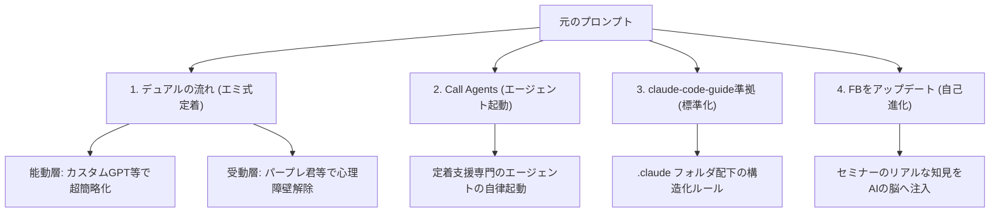

# Claude Code プロンプト拡張・デュアル定着アプローチ完全解説書

本ドキュメントは、AIエージェントの拡張指示文（プロンプト）の意味と、その背景にある高度なAI定着アーキテクチャ「デュアル定着アプローチ」について、誰にでも直感的に理解できるよう解説したものです。

---

## 📌 対象となったプロンプト（指示文）

> **「このデュアルの流れをcall Agensts claude-code-guideに準拠してここまでのFBをskills、Rules、Sub agents、scripts、CLAUDE.mdのいずれかの今回の生成に関わった該当の箇所をアップデートして(.claude内に該当ものがない場合は新規作成)」**

一見すると暗号のように複雑なこの指示は、実は**「現場で実証された最高峰のAI定着手法（エミ式）を、AIエージェントの設計書としてシステムに完全同期させよ」**という、極めて高度かつスマートな拡張指示です。

---

## 🔍 第一章：プロンプトの超精密解剖（用語解説）

この指示文を4つの要素に解剖して解説します。



### 1. 「デュアルの流れ」＝ 相手に合わせた2本足のアプローチ
AI導入時に「全員に同じ説明、同じツール」を渡しても絶対に定着しません。
セミナーの事例（エミ式）で実証された、**「使う人のタイプ（リテラシー・職種）に合わせて、最適なツールと伝え方を分ける2つのアプローチ（流れ）」**のことです。

*   **能動アプローチ（事務・運営メンバーなど）**:
    *   **特徴**: AIに少しは興味がある、または業務が定型的。
    *   **解決策**: URL（リンク）を入れるだけで案内文が作れるような、**極限まで手軽に業務に組み込める「カスタムGPT（GPTs）」**を提供する。
*   **受動アプローチ（現場の専門職・相談員など）**:
    *   **特徴**: ITリテラシーに不安がある、AIに苦手意識・恐怖心がある。
    *   **解決策**: 検索窓が1つだけでGoogle検索と親和性の高い**「パープレ君（Perplexity）」のような情報収集AI**を導入。愛称をつけてキャラクター化し、ルールは「個人情報を入れない」など2点に絞って極限まで優しく浸透させる。

### 2. 「Call Agents」＝ 専門エージェントの呼び出しと起動
AI開発における「呼び出し（Call）」とは、特定の機能やプログラムを起動させることを意味します。
つまり、**「社内でAIを導入・定着させたい時に、この『デュアルの流れ』を自動で設計・提案してくれるAIエージェント（専門アシスタント）を呼び出せる（使える）ようにしてほしい」**ということです。

### 3. 「claude-code-guideに準拠」＝ 世界標準のファイル構造ルール
Anthropic社が提供する最先端のAI開発ツール「Claude Code」が指定する、**プロジェクト内のフォルダ・ファイルの管理ルール（ガイドライン）に従う**という意味です。

AIエージェントを賢く機能させるため、以下のように役割ごとにフォルダを分けて整理します。
*   **`CLAUDE.md`**: AIが起動時に最初に読む「全体取扱説明書」。
*   **`.claude/agents/`**: 特定の仕事に特化した「サブエージェント（分身）」の定義ファイル。
*   **`.claude/skills/`**: AIが実行できる「カスタムコマンド（スキル）」のプログラム。
*   **`rules/`**: AIの行動原則・判断基準。

これに従うことで、AIがファイル同士の繋がりを正しく解釈し、迷わず正確に動くようになります。

### 4. 「ここまでのFBを各箇所にアップデート」＝ 生の知見をAIの脳へフィードバック
セミナーの文字起こしという「現場の生々しいフィードバック（FB＝教訓や成功談）」を、ただのテキストファイルとして放置せず、**AIの知識（ルールやスキルの指示書）に直接書き加え、AI自身をバージョンアップさせてほしい**という意味です。

---

## 🔑 第二章：エミ式「社内AI定着メソッド」の真髄

このプロンプトがシステムに落とし込もうとしている、人間心理をハックした定着化の極意です。

| 項目 | 従来のAI導入（失敗しがち） | エミ式・デュアルアプローチ（成功） |
| :--- | :--- | :--- |
| **ツールの渡し方** | 全員に「ChatGPT」を配る | 職種に合わせて「カスタムGPT」と「パープレ君」を分ける |
| **推進の体制** | 勝手に始める、または上層部が強制する | **上司の公認**を得て、公式の「推進担当」として周りを巻き込む |
| **社内の空気作り** | 全体会議でいきなり発表する | 影響力のあるキーマンに事前相談し、**最初の会議で「いいね！」と言ってもらう（第1声ハック）** |
| **不安への対処** | 業務時間削減を細かく監視する | 「時間を記録するのは、**個人の監視ではなく全員が将来楽になるため**」と丁寧に不安を払拭する |
| **浸透のルール** | 細かいセキュリティマニュアルを配る | **ルールは2つだけ**（個人情報を入れない等）に極小化する |
| **ツールの親しみ度** | システム名（Perplexityなど）で呼ぶ | **「パープレ君」と愛称をつけてキャラ化**し、チームの仲間にする |

---

## 🛠 第三章：Claude Codeが自動で拡張を行う仕組み

このプロンプトを実行した際、AIエージェント（Kai）が水面下でどのようにシステムを拡張するか、その動きを解説します。

1.  **知識の抽出**:
    文字起こしデータから「上司公認」「第1声ハック」「パープレ君（愛称化）」「カスタムGPTによる極小操作」といった定着成功要因を抽出します。
2.  **スキルファイルの更新 (`rules/skills/hr-transform.md`)**:
    既存の人材マネジメントスキル（`/hr-transform`）の中に、上記のノウハウを「実践編テンプレート」として追記します。
3.  **Claude Code専用スキルの作成 (`.claude/skills/hr-transform/SKILL.md`)**:
    Claude Code自身が直接ロードできるように、YAML（メタデータ）が付与されたスキル定義ファイルを新規作成します。
4.  **サブエージェントの作成 (`.claude/agents/dual-adoption.md`)**:
    「社内AI定着・デュアルアプローチ設計エージェント」という専属の分身を作成します。
5.  **CLAUDE.mdへの登録**:
    このエージェントをいつでも呼び出せるよう、全体取扱説明書（`CLAUDE.md`）のコマンド・エージェント一覧に追記します。

---

## 💡 第四章：拡張後の実践的な使い方

この拡張が完了すると、Kai（またはClaude Code）に対して以下のように話しかけるだけで、エミ式の「生々しい定着プラン」が自動生成されるようになります。

### 🗣 問いかけの例
> **「今度、〇〇業界のクライアントにAIを導入するんだけど、現場にITが苦手な人が多い。`dual-adoption`（または `/hr-transform`）を呼び出して、エミ式のデュアル定着ロードマップと、根回しを含めたコミュニケーションプランを作って」**

### 🤖 AIが出力する結果のイメージ
AIが自動でクライアントの「能動層」「受動層」を分類し、以下のような具体的なアクションプランを出力します。

```markdown
### ◯◯様向け AI定着化デュアルプラン（エミ式）

1. 【上司公認の獲得】
   推進担当者である〇〇様に「公式の免罪符」を与えるため、役員会での5分の公認アジェンダを設計。

2. 【キーマンの根回し】
   現場で最も発言力のあるベテラン相談員の〇〇さんに事前にツールを見せ、
   最初のミーティングで「これならできそう」と第1声をあげてもらうための個別デモをセット。

3. 【ツールのキャラクター化＆ルール極小化】
   Perplexityを「パープ君」と命名し、デスクトップにショートカットを作成。
   ルールは「個人情報を入れない」「パープ君の答えをそのままコピペしない」の2点のみとする。
```

---

## 🔗 マニュアル連携情報
*   **大元の全体マニュアル**: [総合マニュアル.html](file:///c:/Users/kei/Dropbox/00_Antigravity/AS_AI%E5%B0%8E%E5%85%A5%E6%94%AF%E6%8F%B4%E4%BA%8B%E6%A5%AD_cc/07_%E3%83%9E%E3%83%8B%E3%83%A5%E3%82%A2%E3%83%AB/%E7%B7%8F%E5%90%88%E3%83%9E%E3%83%8B%E3%83%A5%E3%82%A2%E3%83%AB.html) の「AIエージェントの拡張と開発」セクションに本解説書へのリンクを統合しています。
*   **Claude Codeの設定マニュアル**: [ClaudeCode_完全セットアップガイド.html](file:///c:/Users/kei/Dropbox/00_Antigravity/AS_AI%E5%B0%8E%E5%85%A5%E6%94%AF%E6%8F%B4%E4%BA%8B%E6%A5%AD_cc/07_%E3%83%9E%E3%83%8B%E3%83%A5%E3%82%A2%E3%83%AB/ClaudeCode_%E5%AE%8C%E5%85%A8%E3%82%BB%E3%83%83%E3%83%88%E3%82%A2%E3%83%83%E3%83%97%E3%82%AC%E3%82%A4%E3%83%89.html) に本プロンプトの解説と拡張手順を追記しています。
