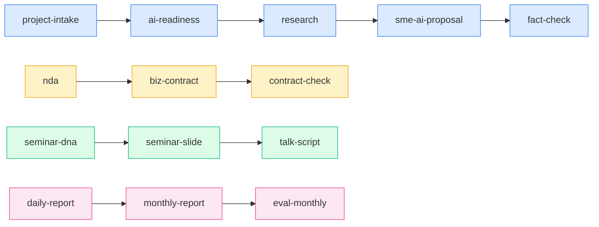

# /skill-radar スキル — スキル棚卸し・連携相関ダッシュボード生成

**経営管理部 × 開発部 共用 — AS資産の現状把握と連携可視化のメタスキル**

**用途:** AS内のスキル・ルール・Agent・アプリ・マニュアル類を巡回して現状把握し、カテゴリ分類 → 連携相関図を生成 → 視覚的ダッシュボードHTMLで出力する。Keiさんが「何が手元にあるか」「何と何が組み合わせ可能か」を視覚的に把握できる定期レポートを作る。

**保存先:**
- ダッシュボード本体: `07_マニュアル/skill-radar/{YYYY-MM-DD}_dashboard.html`
- 履歴: `07_マニュアル/skill-radar/history/{YYYY-MM-DD}.html`
- INDEX: `07_マニュアル/skill-radar/INDEX.md`

---

## このスキルの設計哲学

> **棚卸ししないと、資産は資産にならない。何があるか見えて初めて、組み合わせが生まれる。**
> スキルは「単品」では弱い。連携の地図ができて初めて武器になる。

- 巡回は「今あるもの」の確認、相関図は「組み合わせの可能性」の発見
- 自動実行（毎週日曜18時以降）で気づかぬうちに資産が育つ感覚を作る
- ダッシュボードは「眺めるだけで戦略が浮かぶ」設計にする
- 孤立スキル・未連携スキルこそ宝の山。ギャップ分析で必ず炙り出す
- 差分検出で「先週からの変化」を可視化し、進化の実感を与える

---

## 1. 用途と発動条件

### 明示発動

ユーザーが以下を発言／入力したとき：

- `/skill-radar`
- `/skill-radar --auto` `/skill-radar --quick` `/skill-radar --history`
- 「スキル棚卸しして」「スキルマップ作って」「今あるスキルまとめて」
- 「スキル一覧出して」「何ができるか整理して」
- 「スキル間の連携見せて」「相関図作って」
- 「ASの資産まとめて」「ダッシュボード更新して」

### 自動発動（scheduled-tasks 連動）

- **トリガー:** 毎週日曜 18:00 以降の最初の起動
- **判定方法:** `07_マニュアル/skill-radar/INDEX.md` 最新エントリの日付が直近の日曜より前なら自動起動
- **実行モード:** `--auto`（無確認で生成）
- **登録例:**
  ```
  mcp__scheduled-tasks__create_scheduled_task
    name: skill-radar-weekly
    cron: "0 18 * * 0"
    command: /skill-radar --auto
  ```

---

## 2. 巡回プロトコル（6ステップ）

### Step 1: 巡回対象ファイルの一覧化

Glob で以下のパターンを一括取得し、対象ファイル群を確定する：

```
- rules/skills/*.md                       — スキル定義（30弱）
- rules/skills/*完全マニュアル.html        — スキル別マニュアル
- .claude/agents/*.md                     — サブエージェント定義
- 08_アプリ開発事業部/outputs/*/           — 自社開発アプリ（ディレクトリ単位）
- 07_マニュアル/**/*.html                 — マニュアル類
- rules/_internal_source_meta/INDEX.md   — 内部メタ参照（重複検出用）
- CLAUDE.md                              — プロジェクト規約
- rules/CONSTITUTION.md                  — 憲法
- rules/kai-style-guide.md               — スタイルガイド
```

**Kaiの自律ルール:**
- 各 Glob 結果をリスト化し、件数を計上する
- 5MB超のHTML/MDはサイズだけ記録し本文Readは省略（パフォーマンス対策）
- バイナリ・画像・PDFは対象外（HTMLとMDのみ）

### Step 2: メタ情報の抽出

各ファイルから以下を抽出する：

| 抽出項目 | 抽出方法 |
|---|---|
| **タイトル** | 1行目の `# ...` |
| **用途** | `**用途:**` または冒頭2〜5行 |
| **発動条件** | 「発動条件」「トリガー」セクション |
| **連携先** | 「連携」「次段」「前段」キーワード周辺 |
| **最終更新日** | git log（最新コミット日）または mtime |
| **改訂履歴** | 「改訂履歴」セクションの最新行 |
| **タグ候補** | キーワード密度から推定 |

**抽出失敗時:** 「抽出失敗（理由）」と記録し、スキップせず一覧に残す。

### Step 3: カテゴリ自動タグ付け（5軸）

各スキルに 5軸 のタグを付与する。詳細は §3 参照。

判定ルール：
- 既知パターン辞書（後述）と照合 → ヒットしたら確定タグ
- 複数該当時は主軸 + サブ軸（最大2タグ／軸）
- 不明時は「未分類」タグを付け、ギャップ分析に回す

### Step 4: 連携相関の推論

スキル間の連携を推論する。詳細は §4 参照。

判定優先度：
1. **明示連携**（スキル本文内に「→ /xxx」「次に xxx を実行」等）
2. **既知の連携セット**（営業フロー・契約フロー等の5本ライン）
3. **意味的近接性**（タイトル・用途のキーワード共起）
4. **入出力の対応**（あるスキルの出力がもう一方の入力になる）

### Step 5: 前回ダッシュボードとの差分検出

`07_マニュアル/skill-radar/history/` の最新ファイルと比較し：

- 新規追加スキル（前回になかったファイル）
- 削除スキル（前回あったが今回ない）
- 更新スキル（最終更新日が前回以降）
- 連携変更（前回と相関図エッジが異なる）

差分は「⚠️ 前回比」セクションに反映する。

### Step 6: HTMLダッシュボード生成

§5 のテンプレートに従い生成。Mermaid.js / Chart.js を CDN 経由で読み込む。

生成後の必須アクション：
- 履歴保存（`history/{日付}.html` コピー）
- `INDEX.md` に1行追加
- Kai Tasks にログ記録（`log-action --type output`）
- 大きな変化（新スキル3件以上・新連携5本以上）があれば通知メッセージ

---

## 3. カテゴリ分類軸の定義（5軸）

### 軸1: 業務フェーズ

| タグ | 該当の目安 |
|---|---|
| 営業前 | リサーチ・市場調査・競合分析・ターゲット選定 |
| ヒアリング | hearing-sheet, ai-readiness, demo-data-agent 等 |
| 提案 | sme-ai-proposal, research-proposal, proposal-outline 等 |
| 契約 | nda, biz-contract, contract-check, billing-docs 等 |
| 実行 | course-build, hr-transform, ai-agent-onboard 等 |
| 評価 | eval-daily, eval-weekly, eval-monthly, kpi-design 等 |

### 軸2: アウトプット種類

| タグ | 該当の目安 |
|---|---|
| HTML | beginner-guide, sme-ai-proposal, visualize, rashinban 等 |
| Word | nda, biz-contract, monthly-report, doc-compare 等 |
| Excel | hearing-sheet, billing-docs, wbs-gantt, daily-report 等 |
| PDF | talk-script 入力等 |
| Markdown | research, issue-tree, stakeholder 等 |
| 動画台本 | short-video-conte, long-video-conte, seminar-dna 等 |

### 軸3: 対象顧客

| タグ | 該当の目安 |
|---|---|
| 中小企業 | sme-ai-proposal, ai-readiness, ai-agent-onboard 等 |
| 個人事業主 | brain-article 系、x-content-calendar 等 |
| 大企業 | ma, stakeholder, kpi-design（スケール想定） |
| 社内専用 | eval-*, kei-think, kai-tasks 連動系 |

### 軸4: コンサル/制作分類

| タグ | 該当の目安 |
|---|---|
| 戦略系 | profit-plan, marketing, issue-tree, stakeholder, rashinban |
| 制作系 | seminar-slide, beginner-guide, visualize, billing-docs |
| 検証系 | fact-check, persona-review, contract-check, eval-* |
| コミュニケーション系 | text-refine, talk-script, x-content-calendar |

### 軸5: AI/人間分担

| タグ | 該当の目安 |
|---|---|
| AI主導 | research, finance, fact-check（Kai自律実行） |
| 人間主導 | hearing-sheet, course-build（Keiさんの判断比重大） |
| 協働 | kei-think, marketing, profit-plan（対話前提） |

---

## 4. 連携相関の推論ルール

### 既知の連携セット（5本のフローライン）

ダッシュボードに必ず描画する標準ライン：

#### A. 営業フローライン
```
project-intake → ai-readiness → research → sme-ai-proposal → fact-check → publish-proposal
```

#### B. 提案フローライン
```
research → research-proposal → marketing → sme-ai-proposal → persona-review
```

#### C. 契約フローライン
```
billing-docs → nda → biz-contract → contract-check → doc-compare
```

#### D. 制作フローライン
```
seminar-dna → seminar-slide → talk-script
short-video-conte → seminar-slide
long-video-conte → course-build
```

#### E. 評価フローライン
```
daily-report → monthly-report → eval-daily → eval-weekly → eval-monthly → kpi-design
```

### 推論キーワード辞書

スキル本文中の以下のキーワード周辺から連携を抽出：

| キーワード | 意味 |
|---|---|
| `前段:` / `事前に実行:` | 上流スキル指定 |
| `次に:` / `後段:` / `→ /xxx` | 下流スキル指定 |
| `連携:` / `併用:` | 横連携 |
| `入力:` / `アウトプット:` | I/O 連鎖の検出 |
| `補完:` / `代替:` | 補完関係 |

### 意味的近接性ルール

- タイトル・用途の名詞共起（例: 「契約」を含むスキル同士）
- 業務フェーズが連続するもの（ヒアリング→提案 等）
- アウトプットが次の入力になる関係（Excel ヒアリング → Word 提案）

### 推論の禁止事項

- 推測で連携線を引かない。必ず根拠（キーワード・既知セット・I/O）を明示
- 「たぶん関係ありそう」は ❓ アイコンで弱結線として表示し、本線と区別

---

## 5. ダッシュボードHTMLテンプレ

### 全体構成

```
1. ヘッダ（生成日時・前回比較サマリー・自動／手動表示）
2. KPIカード（スキル総数・カテゴリ別数・新規追加数・孤立数）
3. カテゴリ別マトリクス表（5軸でクロス集計）
4. Mermaid 連携相関図（5本のフローライン）
5. スキル一覧テーブル（ソート・フィルタ可能）
6. ギャップ分析セクション（孤立スキル・未連携スキル）
7. 推奨アクション（Kaiコメント）
8. 前回からの差分セクション
9. フッタ（次回自動実行予定日時）
```

### スタイル基準

- 既存 `07_マニュアル/総合マニュアル.html` および `ダッシュボード_v1.html` の配色・タイポを踏襲
- フォント：`-apple-system, "Segoe UI", "Hiragino Sans", "Yu Gothic", sans-serif`
- カラー：ベース `#0F172A`（紺）/ アクセント `#3B82F6`（青）/ 強調 `#F59E0B`（黄） / 警告 `#EF4444`（赤）
- カード型UI（角丸 12px・影 0 4px 12px rgba(0,0,0,0.08)）
- レスポンシブ（768px ブレークポイント）
- 印刷対応（`@media print` でMermaid SVG固定サイズ・ページ分割設定）

### CDN 読み込み

```html
<script src="https://cdn.jsdelivr.net/npm/mermaid@10/dist/mermaid.min.js"></script>
<script src="https://cdn.jsdelivr.net/npm/chart.js@4/dist/chart.umd.min.js"></script>
```

### Mermaid 描画例



### Chart.js グラフ例

- カテゴリ別スキル数の円グラフ（軸1: 業務フェーズ）
- 業務フェーズ × アウトプット種類のヒートマップ
- 月次推移（スキル総数の時系列、過去履歴がある場合）

---

## 6. 自動実行の動作仕様

### `--auto` フラグの挙動

| 項目 | 挙動 |
|---|---|
| 確認ダイアログ | スキップ（無確認生成） |
| 通知 | 重要変化（後述）がある場合のみKeiさんに通知 |
| エラー処理 | 前回ダッシュボードをコピーし「⚠️ 自動生成失敗」マークを付与 |
| ログ記録 | Kai Tasks の `skill-radar` プロジェクトに `log-action --type output` で記録 |

### `--quick` フラグの挙動

- 差分のみ検出して報告（ダッシュボードHTML生成はスキップ）
- 出力はチャット内のテキストサマリーのみ
- 用途：定期実行の合間に「何か変わった？」を素早く確認したい時

### `--history` フラグの挙動

- `07_マニュアル/skill-radar/history/` の一覧をテーブル表示
- 各履歴の日付・スキル総数・主要変更点・ファイルパスを提示
- Keiさんが過去版を開く際のナビゲーション

### 通知条件（重要変化）

以下のいずれかを満たすとき、生成後にKeiさんへ通知メッセージを出す：

1. 新規スキル追加が3件以上
2. 削除スキルが1件以上
3. 新連携の発見が5本以上
4. 孤立スキル（どのフローにも属さない）が新たに3件以上
5. カテゴリ別分布が前回比 ±15%以上変動

通知文の例：
```
[skill-radar 通知]
今週、新規スキル4件・新連携7本を検出しました。
孤立スキルが2件あります（xxx, yyy）。
ダッシュボード: 07_マニュアル/skill-radar/2026-05-29_dashboard.html
```

### エラー時のフォールバック

1. Glob失敗 → 部分結果で続行・失敗範囲を明示
2. ファイルRead失敗 → 「読み込み失敗」と記録し、メタ抽出をスキップ
3. Mermaid描画失敗 → テキスト版相関図を代替表示
4. HTML書き出し失敗 → 前回ダッシュボードを `history/` からコピー＋「⚠️ 失敗」マーク

---

## 7. 既存スキルとの連携

### /skill-craft との連携

- `skill-craft` で新スキルが生成されたら、その完了通知を受けて `skill-radar` がインクリメンタル更新（差分のみ）
- 連動方法：`skill-craft` の最終STEPに「skill-radar に登録通知」アクションを追加（将来拡張）
- 当面は次回の自動実行で取り込む

### Kai Tasks との連携

- 初回起動時、Kai Tasks に「skill-radar」プロジェクトを作成
  ```bash
  py <CLI> create --name "skill-radar 定期棚卸し" --goal "毎週のスキル棚卸しと連携可視化"
  ```
- 各実行で `log-action --type output --summary "ダッシュボード生成 (YYYY-MM-DD)"` を記録
- 大きな変化があれば `pivot` で「スキル構成の転換」を記録

### /eval-weekly との連携

- 週次評価レポートの参考資料として最新ダッシュボードをリンク
- 「先週からのスキル進化」を `eval-weekly` のサマリーに織り込み可能

### 内部メタプロトコルとの関係

- `skill-radar` は **AS内部資産の棚卸し** であり、外部素材取り込みではないため `_internal_source_meta` への記録は不要
- ただし、巡回時に `_internal_source_meta/INDEX.md` の存在は確認し、外部素材ベースのスキル（seminar-dna 等）の数を計上に含める

---

## 8. 履歴管理ルール

### ディレクトリ構造

```
07_マニュアル/skill-radar/
├── INDEX.md                           — 履歴INDEX（生きた目次）
├── {YYYY-MM-DD}_dashboard.html        — 最新ダッシュボード（直近1件）
└── history/
    ├── 2026-05-29.html
    ├── 2026-05-22.html
    └── ...
```

### INDEX.md のフォーマット

```markdown
# skill-radar 履歴INDEX

| 生成日 | スキル総数 | 新規 | 削除 | 主要変更 | ファイル |
|---|---|---|---|---|---|
| 2026-05-29 | 47 | +2 | 0 | 営業フローに ai-readiness 追加 | [HTML](history/2026-05-29.html) |
| 2026-05-22 | 45 | +1 | 0 | 制作フローに talk-script 追加 | [HTML](history/2026-05-22.html) |
```

### 保管期間

- 直近12週間は全て保持
- 12週超は月初版のみ残し、それ以外は archive 化（zip）
- 自動削除はしない（Keiさんの明示指示で削除）

---

## 9. Kaiの自律実行プロトコル

### 起動時の動作

1. 引数解析（`--auto` / `--quick` / `--history`）
2. `07_マニュアル/skill-radar/` 存在確認・なければ作成
3. `INDEX.md` 存在確認・なければ初期化
4. 前回ダッシュボードの日付確認（自動モード時の重複起動防止）

### 巡回〜生成の所要時間目安

| ステップ | 所要時間 |
|---|---|
| Glob一覧化 | 5〜10秒 |
| メタ情報抽出 | 30〜60秒（30〜50ファイル想定） |
| カテゴリタグ付け | 10〜20秒 |
| 連携相関推論 | 20〜40秒 |
| 差分検出 | 5〜10秒 |
| HTML生成 | 10〜20秒 |
| **合計** | **約2〜3分** |

### 生成後の必須報告

手動実行時、以下を1メッセージで報告：

```
[skill-radar 完了報告]
- 生成日: 2026-05-29 18:23
- スキル総数: 47件
- 新規追加: 2件（xxx, yyy）
- 連携相関: 5フロー描画（営業・提案・契約・制作・評価）
- 孤立スキル: 3件（xxx, yyy, zzz）→ ギャップ分析参照
- ダッシュボードURL: 07_マニュアル/skill-radar/2026-05-29_dashboard.html
- 推奨アクション: ① xxx と yyy の連携検討 / ② zzz の活用度確認
```

---

## 10. ギャップ分析の出し方

### 孤立スキルの定義

- どのフローライン（A〜E）にも属さない
- かつ他スキルとの相関エッジが0本

→ ダッシュボードの「⚠️ 孤立スキル」セクションに列挙。

### 未連携の組み合わせ候補

Kaiが意味的近接性から推論し、「連携すると強い候補」を3〜5件提案：

```
[Kai推奨]
- /stakeholder + /sme-ai-proposal → 提案前に意思決定者マップを作る運用
- /kpi-design + /eval-weekly → 週次評価をKPI体系に紐づける
- /hr-transform + /ai-agent-onboard → 人材設計と導入支援をパッケージ化
```

### 過剰スキル・重複候補の検出

- 同じカテゴリに3件以上のスキルがある場合は「統合候補?」と注記
- ただし削除提案はしない（Keiさんの判断領域）

---

## 11. コピペ用：起動コマンド例

```
/skill-radar                # 手動実行・対話モード（生成前に要点確認）
/skill-radar --auto         # 自動実行モード（無確認生成・scheduled-tasksから）
/skill-radar --quick        # クイックスキャン（差分テキストサマリーのみ）
/skill-radar --history      # 過去ダッシュボード一覧表示
```

### 自然言語の発動例

```
「スキル棚卸ししよう」
「今月のスキルマップ作って」
「ASの資産まとめて」
「スキル間の連携見せて」
「先週から何が変わった?」  → 内部的に --quick 相当
「過去のスキル状況見たい」  → 内部的に --history 相当
```

---

## 12. 出力物のサンプル構造

### ダッシュボードHTML（章立て）

```
┌───────────────────────────────────────┐
│ AS Skill Radar Dashboard              │
│ 2026-05-29 18:23 / 自動実行 / 前回比+2│
├───────────────────────────────────────┤
│ [KPIカード] 47 | 2 | 0 | 3            │
│ 総数 | 新規 | 削除 | 孤立             │
├───────────────────────────────────────┤
│ [カテゴリ別マトリクス]                 │
│   業務フェーズ × アウトプット種類      │
│   業務フェーズ × 対象顧客             │
├───────────────────────────────────────┤
│ [連携相関図 Mermaid]                   │
│   A. 営業フロー                       │
│   B. 提案フロー                       │
│   C. 契約フロー                       │
│   D. 制作フロー                       │
│   E. 評価フロー                       │
├───────────────────────────────────────┤
│ [スキル一覧テーブル]                   │
│   タイトル | 用途 | タグ | 更新日 | 連携│
├───────────────────────────────────────┤
│ [ギャップ分析]                         │
│   孤立スキル / 連携推奨候補            │
├───────────────────────────────────────┤
│ [Kai推奨アクション]                    │
│   ① ... ② ... ③ ...                  │
├───────────────────────────────────────┤
│ [前回からの差分]                       │
│   新規・更新・削除・連携変更           │
├───────────────────────────────────────┤
│ Footer: 次回自動実行 2026-06-05 18:00 │
└───────────────────────────────────────┘
```

### 容量見込み

- HTML本体：約 80〜150 KB（Mermaid/Chart.js は CDN なので含まず）
- ローカルキャッシュなし：CDN経由で常に最新ライブラリ
- スキル50件 × メタ情報 × Mermaid SVG ≒ 100KB 前後

---

## 13. 失敗パターンと対処

| 失敗パターン | 対処 |
|---|---|
| Globでファイルが見つからない | パスを stderr に出力・対象0件と明示 |
| Mermaid構文エラー | フォールバックでテキストツリー表示 |
| 履歴ファイル肥大化 | INDEX.md に注意マーク・Keiさんに archive 提案 |
| 連携相関が複雑すぎて視認性低下 | フローライン別に5つの図に分割（既定動作） |
| 自動実行が二重起動 | INDEX.md 最新日付チェックで重複起動を抑止 |

---

## 14. 改訂履歴

- **2026-05-29 v1.0** — 初版（Keiさん指示で巡回・カテゴリ分類・5本フロー相関図・ダッシュボードHTML生成スキルとして整備。自動実行モード／--quick／--history／scheduled-tasks 連動を含む。Kai Tasks連動と通知条件を明文化）

---

## 15. 関連スキル・ドキュメント

- `/skill-craft` — 新スキル作成時に skill-radar への登録を将来連動
- `/eval-weekly` `/eval-monthly` — 週次・月次評価で本ダッシュボードを参照
- `/visualize` `/rashinban` — Mermaid/Chart.js のスタイル基準を共有
- `CLAUDE.md` — スキル一覧の正本
- `rules/CONSTITUTION.md` — 自律判断・データ取り扱い原則
- `07_マニュアル/総合マニュアル.html` — UIスタイル基準
- `08_アプリ開発事業部/outputs/kai-tasks/` — Kai Tasks 連動先
